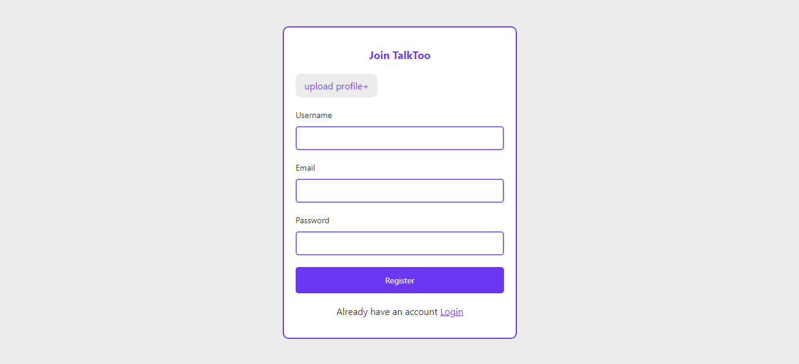

## Realtime Chat App

[Live Demo](https://talktoo.netlify.app/)

### Description

React chat app with a ton of features like authentication, creating a chat, sending messages, creating groups,adding and removing users from groups and much more fun stuff.

### Features

- signup/login

 

 

-  one on one chat

-  group chat

-  updating profile

-  creating group

and much more

### Built with

 #### UI
- ReactJs
- styled components

##### [Api]("https://github.com/oliverwanyonyi/chatapp-server")
- expressjs
- database, mongodb

